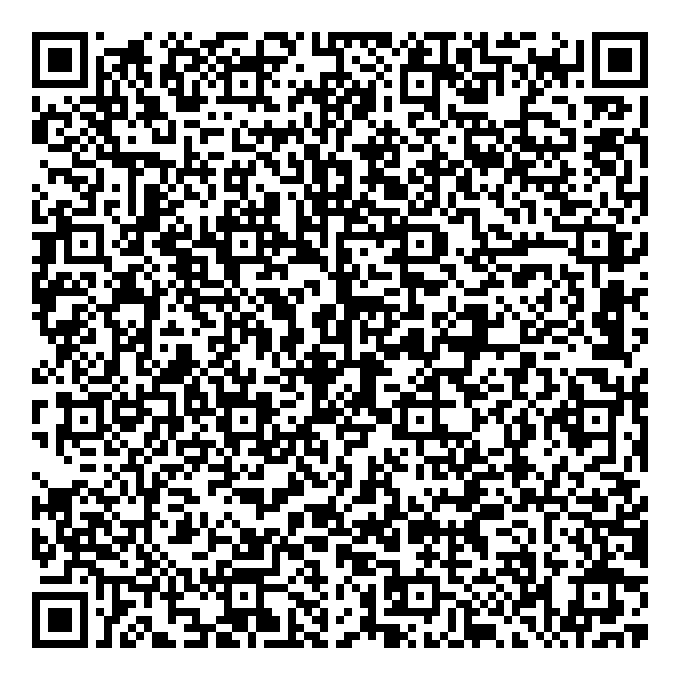

# Bluetooth Disable

**Язык:** [Русский](README.md) | [English](README_EN.md)

Bluetooth Disable — Android-приложение для системной блокировки Bluetooth через Android Device Policy.

Будучи назначенным **Device Owner**, приложение применяет системное ограничение `UserManager.DISALLOW_BLUETOOTH`. Пока ограничение активно, Android запрещает штатное включение и использование Bluetooth. Дополнительно приложение выполняет best-effort попытку немедленно выключить уже активный адаптер.

## Скачать

Актуальная версия публикуется в [GitHub Releases](https://github.com/alcovaibe/Bluetooth-disabler/releases/latest).

Для установки в режиме Device Owner также доступен автоматически обновляемый QR-код — см. раздел [«Установка через Device Owner QR»](#установка-через-device-owner-qr).

## Возможности

- системная блокировка Bluetooth через Device Owner;
- сохранение ограничения после закрытия приложения и перезагрузки устройства;
- Quick Settings tile для управления и доступа к приложению;
- четыре полноценных Cover Mode: Калькулятор, Заметки, Календарь и Галерея;
- отдельный скрытый способ входа для каждого Cover Mode;
- аварийное восстановление через системную аутентификацию Android;
- смена launcher-значка и названия приложения;
- русский и английский интерфейс;
- светлая и тёмная темы;
- работа без root, Shizuku, Magisk и Accessibility Service.

## Как работает защита Bluetooth

Основной механизм:

```text
Device Owner
    ↓
DevicePolicyManager
    ↓
UserManager.DISALLOW_BLUETOOTH
    ↓
Android запрещает использование Bluetooth
```

После применения ограничения приложение повторно проверяет фактическое состояние policy. Прямая команда выключения Bluetooth используется только как best-effort способ ускорить видимое отключение уже активного адаптера.

## Cover Mode

Cover Mode меняют launcher-идентичность приложения и стартовый интерфейс. Каждый режим представляет собой отдельный рабочий локальный интерфейс, а не только смену значка.

| Режим | Скрытый вход | Аварийное восстановление | Документация |
| --- | --- | --- | --- |
| **Калькулятор** | Пятизначный код и нажатие `=` | Удержание заголовка «История» 3 секунды | [Calculator Cover Mode](docs/covermode/calculator/ru/README.md) |
| **Заметки** | Нажатие на настроенный секретный фрагмент выбранной заметки | Удержание кнопки `+` 3 секунды | [Notes Cover Mode](docs/covermode/notes/ru/NOTES_COVER_MODE.md) |
| **Календарь** | Открытие заметки с настроенным текстом на секретной дате | Удержание заголовка календаря или элемента перехода к сегодняшней дате 3 секунды | [Calendar Cover Mode](docs/covermode/calendar/ru/CALENDAR_COVER_MODE.md) |
| **Галерея** | Секретная фотография и последовательность из трёх зон экрана | Удержание заголовка «Галерея» 3 секунды | [Gallery Cover Mode](docs/covermode/gallery/ru/GALLERY_COVER_MODE.md) |

Секреты доступа не хранятся в открытом виде. Для их проверки используются механизмы на базе Android Keystore.

### Аварийное восстановление

Recovery flow использует системную аутентификацию Android: биометрию или доступные учётные данные устройства — PIN-код, графический ключ либо пароль.

После успешной аутентификации пользователь отдельно подтверждает сброс активного Cover Mode. Отмена проверки или подтверждения не изменяет текущий режим.

Если Quick Settings tile уже добавлен, Bluetooth Disable также можно открыть через плитку.

## Конфиденциальность и хранение данных

Bluetooth Disable придерживается принципа минимальных разрешений.

Приложение:

- не содержит рекламы;
- не содержит аналитики или трекеров;
- не имеет разрешения `INTERNET`;
- не получает местоположение;
- не сканирует и не перечисляет удалённые или сопряжённые Bluetooth-устройства;
- не подключается к удалённым Bluetooth-устройствам;
- не отправляет заметки, фотографии или другие пользовательские данные на сервер.

На Android 12+ разрешение `BLUETOOTH_CONNECT` используется только для best-effort попытки немедленно выключить локальный Bluetooth-адаптер. Device Owner может предоставить это разрешение приложению через Device Policy.

Пользовательские данные исключены из Android backup и device-to-device transfer. Дополнительная защита локального состояния использует ключи Android Keystore: если app-private данные будут перенесены на другое устройство без соответствующих неэкспортируемых ключей, приложение сбрасывает перенесённое состояние к состоянию чистой установки.

## Требования

- Android 8.0 (API 26) или новее;
- для системной блокировки Bluetooth приложение должно быть назначено Device Owner.

Назначение Device Owner обычно выполняется во время первоначальной настройки Android и может потребовать сброса устройства. Перед сбросом сохраните необходимые данные.

## Установка через Device Owner QR

Стабильный QR-код последней опубликованной сборки:



Базовый сценарий:

1. сохраните необходимые данные и подготовьте устройство к первоначальной настройке;
2. откройте QR provisioning в Android Setup Wizard и подключитесь к Wi-Fi;
3. отсканируйте QR-код выше и дождитесь загрузки и проверки APK;
4. завершите provisioning и убедитесь, что Bluetooth Disable назначен Device Owner.

Поведение Setup Wizard и способ входа в QR provisioning могут отличаться в зависимости от версии Android и производителя устройства.

[Подробная документация Device Owner QR provisioning](docs/QR_PROVISIONING.md)

## Сборка и тестирование

Проект использует Kotlin, Jetpack Compose, Material 3, Android Device Policy и Android Keystore.

CI выполняет unit-тесты, Android Lint, сборку приложения и instrumentation-тесты. Совместимость Cover Mode проверяется на Android API 26–36.

Для production release используется отдельный signing keystore через GitHub Actions secrets или локальный `keystore.properties`.

## Обратная связь

Ошибки и воспроизводимые проблемы можно оформлять через [GitHub Issues](https://github.com/alcovaibe/Bluetooth-disabler/issues).

Для отчёта желательно указывать модель устройства, версию Android, способ provisioning и точные шаги воспроизведения.

## Лицензия

Bluetooth Disable распространяется по лицензии **GNU General Public License v3.0 or later (GPL-3.0-or-later)**.

Полный текст лицензии находится в [LICENSE](LICENSE), дополнительные сведения — в [LICENSE-NOTICE](LICENSE-NOTICE).
